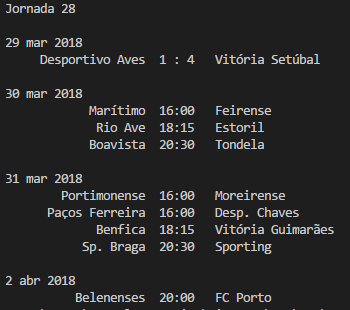
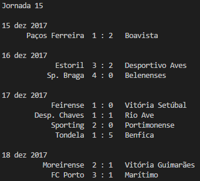

# 1. About
  These project is about the Portuguese league, there are two files with different objectives:

  - [classification.py](https://github.com/mferreira96/football_games/blob/master/classification.py) -> Gives the actual classification of the Portugues league 
  - [journey.py](https://github.com/mferreira96/football_games/blob/master/journey.py) -> Gives the games of a specific journey 

# 2. Requirements

```
  Python 3.x
  Beautifulsoup 4
```


# 3. How to install?

  ```python
  pip install beautifulsoup4
  ```  
# 4. Output

  ## 4.1. Classification
  ```python
  py classification.py
  ```
  

  ## 4.2. Journey

  ```python
  py journey.py
  ```
  

  ```python
  py journey.py number
  
  number = the number of the journey that you want.
  ```

  
