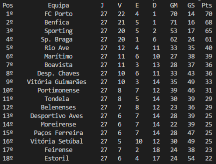

# football_games

https://www.crummy.com/software/BeautifulSoup/bs4/doc/

http://www.pythonforbeginners.com/beautifulsoup/beautifulsoup-4-python

# About
  These project is about the Portuguese league, there are two files with different objectives:

  - classification.py -> Gives the actual classification of the Portugues league 
  - journey.py -> Gives the games of a specific journey 

# Requirements

```
  Python 3.x
  Beautifulsoup 4
```


# How to install?

  ```python
  pip install beautifulsoup4
  ```  
# Output

  ## Classification
  ```python
  py classification.py
  ```
  
